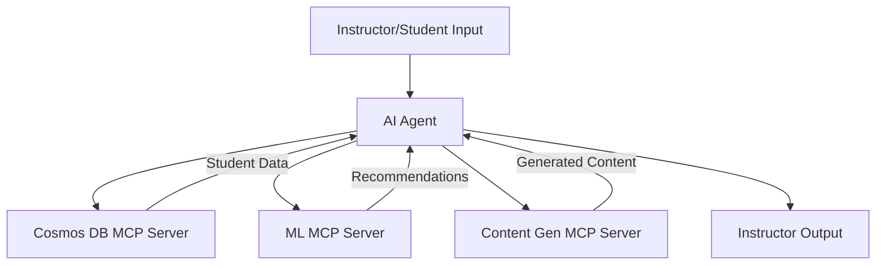

# Use Case: Auto-Curriculum Builder for Instructors

## Description
An AI agent that generates personalized curricula, lesson plans, or educational content for instructors based on student needs or course goals.

---

## Azure MCP Servers & Tech Stack

### 1. Azure Cosmos DB MCP Server
- **Purpose:** Stores and retrieves educational content, student profiles, or learning objectives.
- **Implementation:** An MCP server hosted on Azure Functions exposes actions like `fetch_student_data` or `retrieve_course_template` by querying Azure Cosmos DB, which stores structured and semi-structured educational data.
- **Azure Components:** Azure Cosmos DB, Azure Functions

### 2. Azure Machine Learning MCP Server
- **Purpose:** Recommends personalized learning paths or content based on student performance or preferences.
- **Implementation:** Use Azure Machine Learning to train models that predict optimal curricula. The MCP server, hosted on Azure App Service, exposes recommendation actions for the AI agent.
- **Azure Components:** Azure Machine Learning, Azure App Service, Azure SQL Database (for training data)

### 3. Content Generation MCP Server
- **Purpose:** Generates lesson plans, quizzes, or study materials.
- **Implementation:** Integrate Azure OpenAI Service to generate educational content. The MCP server, running on Azure Functions, exposes actions like `generate_lesson_plan` with context from Cosmos DB or Blob Storage.
- **Azure Components:** Azure OpenAI Service, Azure Functions, Azure Blob Storage

---

## How MCP Fits
MCP servers provide standardized interfaces for data retrieval, recommendation, and content generation, enabling the AI agent to build curricula dynamically.

---

## Architecture & Workflow


---

## Example Actions & Pseudocode
- `fetch_student_data(student_id)`
- `recommend_curriculum(student_profile)`
- `generate_lesson_plan(course_outline)`


```python
# Pseudocode
student = agent.call_mcp('fetch_student_data', {'student_id': '123'})
recommendation = agent.call_mcp('recommend_curriculum', {'profile': student})
lesson_plan = agent.call_mcp('generate_lesson_plan', {'outline': recommendation})
```

> [!WARNING]
> It should be noted that this is a conceptual overview. Actual implementation will require specific Azure SDKs and configurations. This example is meant to illustrate how MCP can be applied in a curriculum-building scenario, not as an exact codebase.

---

## Resources
- [Azure Cosmos DB](https://azure.microsoft.com/en-us/products/cosmos-db/?WT.mc_id=%3Fwt.mc_id%3DMVP_452430)
- [Azure Machine Learning](https://azure.microsoft.com/en-us/products/machine-learning/?WT.mc_id=%3Fwt.mc_id%3DMVP_452430)
- [Azure OpenAI Service](https://azure.microsoft.com/en-us/products/ai-services/openai-service/?WT.mc_id=%3Fwt.mc_id%3DMVP_452430)
