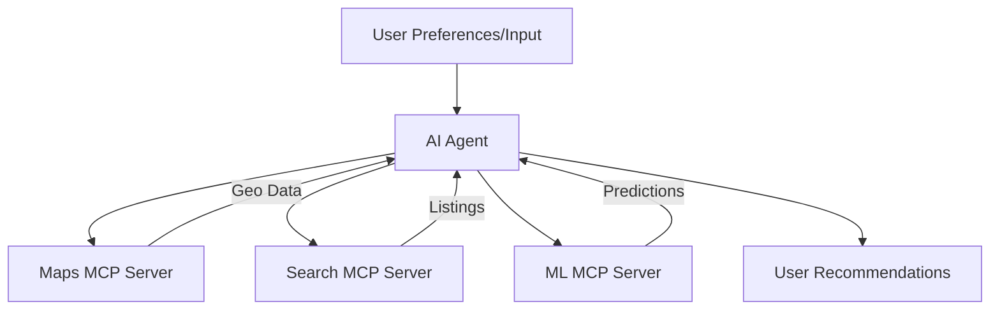

# Use Case: Local Optimization Agent (e.g., Real Estate Scout)

## Description
An AI agent that optimizes local searches, such as finding real estate properties based on user preferences, market conditions, or geographic data.

---

## Azure MCP Servers & Tech Stack

### 1. Azure Maps MCP Server
- **Purpose:** Provides geospatial data for property searches (e.g., proximity to amenities, neighborhood analysis).
- **Implementation:** An MCP server hosted on Azure Functions uses Azure Maps to expose actions like `search_properties_by_location` or `analyze_neighborhood`. Data is stored in Azure Cosmos DB for geospatial queries.
- **Azure Components:** Azure Maps, Azure Functions, Azure Cosmos DB

### 2. Azure Cognitive Search MCP Server
- **Purpose:** Indexes and searches real estate listings or market data.
- **Implementation:** Use Azure Cognitive Search to index property data stored in Azure Blob Storage or Azure SQL Database. The MCP server exposes search actions for the AI agent to retrieve relevant listings.
- **Azure Components:** Azure Cognitive Search, Azure Blob Storage, Azure SQL Database

### 3. Azure Machine Learning MCP Server
- **Purpose:** Predicts property value trends or matches properties to user preferences.
- **Implementation:** Host an MCP server on Azure App Service that uses Azure Machine Learning models to provide actions like `predict_property_value` or `recommend_properties`.
- **Azure Components:** Azure Machine Learning, Azure App Service, Azure Data Lake (for historical data)

---

## How MCP Fits
MCP servers standardize access to geospatial data, search capabilities, and predictive analytics, enabling the AI agent to optimize real estate searches.

---

## Architecture & Workflow


---

## Example Actions & Pseudocode
- `search_properties_by_location(location, filters)`
- `search_listings(query)`
- `predict_property_value(property_details)`

```python
# Pseudocode
geo_results = agent.call_mcp('search_properties_by_location', {'location': 'Seattle', 'filters': {...}})
listings = agent.call_mcp('search_listings', {'query': geo_results})
predictions = agent.call_mcp('predict_property_value', {'property_details': listings})
```

> [!WARNING]
> It should be noted that this is a conceptual overview. Actual implementation will require specific Azure SDKs and configurations. This example is meant to illustrate how MCP can be applied in a real estate scenario, not as an exact codebase.

---

## Resources
- [Azure Maps](https://azure.microsoft.com/en-us/products/azure-maps/?WT.mc_id=%3Fwt.mc_id%3DMVP_452430)
- [Azure AI Search](https://azure.microsoft.com/en-us/products/ai-services/cognitive-search/?WT.mc_id=%3Fwt.mc_id%3DMVP_452430)
- [Azure Machine Learning](https://azure.microsoft.com/en-us/products/machine-learning/?WT.mc_id=%3Fwt.mc_id%3DMVP_452430)
