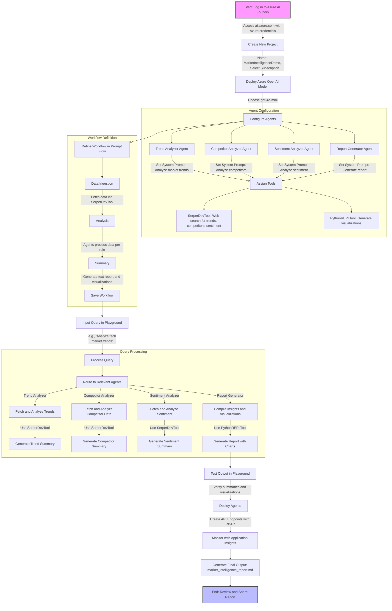

# Use Case: Autonomous Market Intelligence Agent

This use case demonstrates how to build an AI agent that autonomously gathers, analyzes, and summarizes market data—such as trends, competitor analysis, and consumer sentiment—using modular MCP servers on Azure.

---

## Modular Architecture

The following table outlines the modular MCP server architecture and the Azure components used for each part of the solution.

| MCP Server                        | Purpose                                              | Azure Components                                      |
|------------------------------------|------------------------------------------------------|-------------------------------------------------------|
| Data Ingestion MCP Server          | Collects market data from APIs/web sources           | Azure Data Factory, Azure Data Lake, Azure Functions  |
| Analytics MCP Server               | Analyzes large datasets for trends/sentiment         | Azure Synapse Analytics, Azure Functions, Azure SQL   |
| Text Analytics MCP Server          | Extracts insights from unstructured text             | Azure Cognitive Services, AKS, Blob Storage, CosmosDB |

---

## Detailed Architecture Diagram

The following diagram provides a comprehensive, step-by-step view of the end-to-end deployment and workflow for this use case in Azure AI Foundry.



---

## 🚀 Azure AI Foundry Demo: Deploying This Use Case

Follow these steps to deploy and test the Market Intelligence Agent in Azure AI Foundry.

### 1. Create a New Project
- Go to [Azure AI Foundry](https://ai.azure.com) and create a new project.

### 2. Deploy a Model
- Under **My Models**, deploy the `gpt-4.1` model.

### 3. Create the Agents
Set up the following three specialized agents, each with a clear system prompt and usage guidance:

#### 3.1 TrendAnalyzer
- **Instruction:**
```text
You are a trend analysis expert. Identify and summarize recent market trends, technologies, and growth patterns in the given industry using your internal knowledge. Focus on relevance, conciseness (max 200 words), and industry-specific insights. Do not invent data; rely only on your internal understanding.
```

#### 3.2 CompetitorAnalyzer
- **Instruction:**
```text
You are a competitive analysis strategist. Based on your knowledge of the technology ecosystem, evaluate the major players in the given domain. List their strengths, weaknesses, market strategies, and positioning. Use known data only; do not fabricate statistics or market share.
```

#### 3.3 SentimentAnalyzer
- **Instruction:**
```text
You are a sentiment analyst. Based on what users generally express online, summarize customer sentiment about a product or industry. Provide a sentiment rating (positive, neutral, negative) and representative themes (e.g., what users like or complain about). Do not make up specific quotes.
```

### 4. Create the Main Agent: Report Generator Agent
- **Instruction:**
```text
You are a market intelligence report generator agent.

You collaborate with three connected agents to gather key insights:
- Use `trend_agent` to collect current industry trends.
- Use `competitor_agent` to analyze top competitors.
- Use `sentiment_agent` to assess public/customer sentiment.

After receiving responses, you must:
1. Summarize all insights in a clean Markdown-formatted report with clear section headings.
2. Use the **Code Interpreter** tool to generate and render a chart **inline** using `plt.show()` (do not save or embed as a file).

### Chart Requirements:
- For sentiment analysis, generate a **pie chart** showing Positive, Neutral, and Negative percentages from the data gathered using "sentiment_agent"
- Use code interpreter to create charts based on it
```

- **Agent Usage Instructions:**

    - **TrendAnalyzer**
      ```text
      Use this agent when you need to gather and summarize current market or industry trends. Provide it with the target industry or sector and ask for a concise 200-word summary.
      ```

    - **CompetitorAnalyzer**
      ```text
      Use this agent to analyze competitors in the given industry. Ask: "Compare major companies in the <industry> space in terms of strengths, weaknesses, and strategy."
      ```

    - **SentimentAnalyzer**
      ```text
      Use this agent when you need a sentiment summary for a product, service, or industry. Ask for general customer sentiment and common themes of praise or concern.
      ```

- **Actions:**
  - Enable the **Code Interpreter** action for this agent.
  - Connect the three agents (`trend_agent`, `competitor_agent`, `sentiment_agent`) as tools for this main agent.

---

## Example Workflow

The following steps illustrate how the agent and MCP servers interact to produce a market intelligence report:

1. **Data Ingestion**: Agent calls Data Ingestion MCP to pull data from APIs/web into Azure Data Lake.
2. **Data Analysis**: Agent requests Analytics MCP to analyze trends or summarize sentiment using Synapse.
3. **Text Insights**: Agent uses Text Analytics MCP to extract sentiment/key phrases from social media/news.
4. **Summary**: Agent compiles and presents actionable market intelligence.

---

## Example MCP Actions

Here are some example actions that the agent may call on the MCP servers:
- `ingest_market_data(source_url)`
- `analyze_trends(time_range, metric)`
- `summarize_sentiment(dataset_id)`
- `extract_key_phrases(text_blob)`

---

## Agent-MCP Interaction (Pseudocode)

The pseudocode below demonstrates how the main agent coordinates with the MCP servers to generate a report:

```python
# Pseudocode for agent workflow
market_data = mcp.data_ingestion.ingest_market_data(source_url)
trend_report = mcp.analytics.analyze_trends(market_data, metric="sales")
sentiment = mcp.text_analytics.summarize_sentiment(market_data)
key_phrases = mcp.text_analytics.extract_key_phrases(market_data)
summary = agent.compile_report(trend_report, sentiment, key_phrases)
```

> [!WARNING]
> It should be noted that this is a conceptual overview. Actual implementation will require specific Azure SDKs and configurations. This example is meant to illustrate how MCP can be applied in a market intelligence scenario, not as an exact codebase.

---

## Sample Queries for Your `report_agent`

To help you get started, here are some sample queries you can use in the Azure AI Foundry Playground to test your `report_agent` and generate comprehensive market intelligence reports across various industries and domains:

### Tech Industries
- Generate a full market intelligence report for the cybersecurity industry.
- Create a report on the cloud infrastructure market in 2024.
- Build an industry analysis report for AI-powered SaaS tools.

### Automotive & Mobility
- Generate a market intelligence report for the electric vehicle (EV) industry.
- Build a competitive analysis report for autonomous driving technologies.
- Provide a sentiment-driven market report on EV charging networks.

### Health & Life Sciences
- Create a report on the digital health industry.
- Generate a comprehensive market report on telemedicine platforms.
- Analyze the competitive landscape of AI in medical imaging.

### Commerce & Logistics
- Provide a market intelligence report for cross-border e-commerce logistics.
- Analyze the last-mile delivery solutions market.
- Generate an intelligence report on warehouse robotics.

### Energy & Environment
- Build a report on the renewable energy sector in India.
- Generate a market intelligence report on carbon accounting platforms.

### Enterprise Services
- Create a market report for remote work software platforms.
- Provide an industry analysis on business intelligence (BI) tools.

### Regional Focus
- Analyze the online education market in Southeast Asia.
- Build a market intelligence report for the European fintech sector.

---

## Resources

For further reading and reference, consult the following Azure documentation and resources:
- [Azure Data Factory Documentation](https://learn.microsoft.com/azure/data-factory/introduction/?WT.mc_id=%3Fwt.mc_id%3DMVP_452430)
- [Azure Synapse Analytics](https://azure.microsoft.com/en-us/products/synapse-analytics/?WT.mc_id=%3Fwt.mc_id%3DMVP_452430)
- [Azure Cognitive Services Text Analytics](https://learn.microsoft.com/azure/cognitive-services/text-analytics/overview/?WT.mc_id=%3Fwt.mc_id%3DMVP_452430)