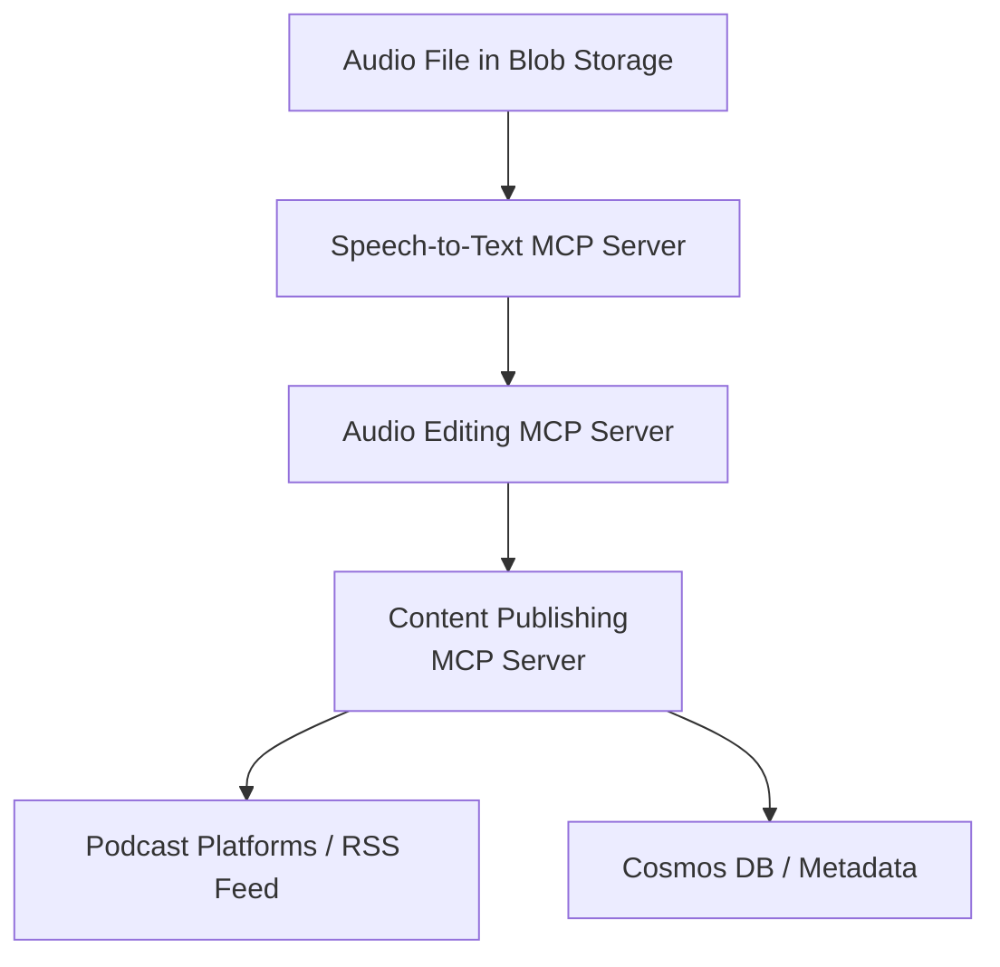

# MCP Use Cases: End-to-End Podcast Producer

This document explores a real-world use case for MCP (Model Context Protocol) in the Azure ecosystem: building an AI agent that automates podcast production from audio transcription to publishing.

## Use Case Overview

**End-to-End Podcast Producer**
- An AI agent that automates podcast production, including scripting, audio editing, transcription, and publishing.

### Example MCP Servers on Azure

| MCP Server                | Purpose                                              | Azure Components                                      |
|---------------------------|------------------------------------------------------|-------------------------------------------------------|
| Speech-to-Text MCP Server | Transcribes podcast audio to text for scripts/notes  | Azure Speech Service, Blob Storage, Azure Functions    |
| Audio Editing MCP Server  | Edits audio (noise reduction, trimming, etc.)        | Azure ML, Blob Storage, Azure Functions               |
| Content Publishing MCP    | Publishes podcast, generates metadata (RSS, etc.)    | Azure App Service, Cosmos DB, API Management          |

Each MCP server exposes specific actions (e.g., `transcribe_audio`, `edit_audio`, `publish_podcast`) that the AI agent can call, with context data (audio files, metadata) stored in Azure Blob Storage or Cosmos DB.

## 🗺️ Architecture Diagram



## Example Workflow
1. **Transcription**: Agent calls the Speech-to-Text MCP server to transcribe audio files from Blob Storage.
2. **Audio Editing**: Agent sends audio to the Audio Editing MCP server for processing.
3. **Publishing**: Agent calls the Content Publishing MCP server to publish the final podcast and update metadata.

## How MCP Fits
- MCP servers provide standardized interfaces for each step (transcription, editing, publishing).
- The agent orchestrates the workflow by calling each MCP server in sequence, passing context (audio, text, metadata) between them.
- All data and actions are managed securely and scalably using Azure services.


## Example: Speech-to-Text MCP Server (Python Pseudocode)

```python
# This is a conceptual example. Replace with actual Azure SDK and MCP server code.
from azure.cognitiveservices.speech import SpeechConfig, SpeechRecognizer, AudioConfig
from azure.storage.blob import BlobClient

def transcribe_audio(blob_url, speech_key, region):
    # Download audio from Azure Blob Storage
    blob = BlobClient.from_blob_url(blob_url)
    with open('temp.wav', 'wb') as f:
        f.write(blob.download_blob().readall())
    # Transcribe using Azure Speech Service
    speech_config = SpeechConfig(subscription=speech_key, region=region)
    audio_config = AudioConfig(filename='temp.wav')
    recognizer = SpeechRecognizer(speech_config, audio_config)
    result = recognizer.recognize_once()
    return result.text

# The MCP server would expose this as an action (e.g., 'transcribe_audio')
```

> [!WARNING]
> It should be noted that this is a conceptual overview. Actual implementation will require specific Azure SDKs and configurations. This example is meant to illustrate how MCP can be applied in a podcast production scenario, not as an exact codebase.

## Resources
- [Azure Speech Service](https://learn.microsoft.com/azure/ai-services/speech-service/?WT.mc_id=%3Fwt.mc_id%3DMVP_452430)
- [Azure Blob Storage](https://learn.microsoft.com/azure/storage/blobs/?WT.mc_id=%3Fwt.mc_id%3DMVP_452430)
- [Azure Functions](https://learn.microsoft.com/azure/azure-functions/?WT.mc_id=%3Fwt.mc_id%3DMVP_452430)
- [Model Context Protocol (MCP)](https://modelcontextprotocol.io/introduction)