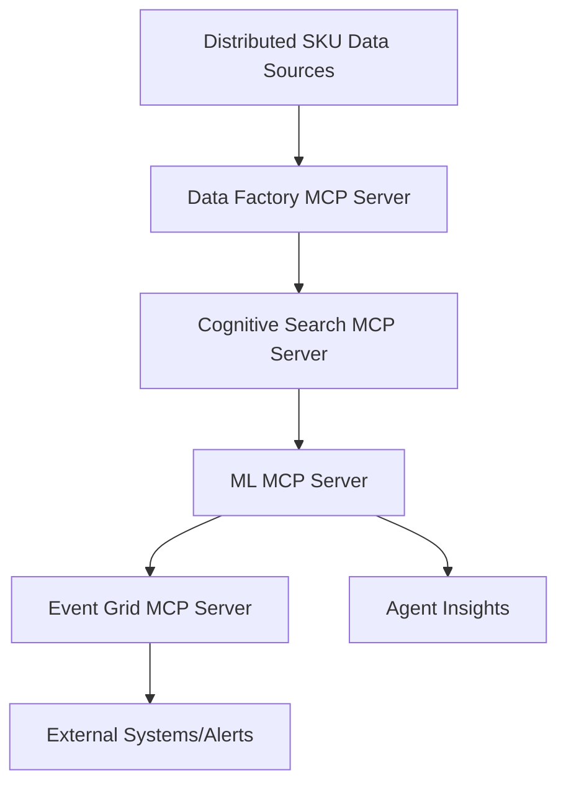

# Use Case: SKU Intelligence Agent Across Hybrid Clouds

## Description
An autonomous SKU Intelligence Agent that connects to distributed data sources across hybrid clouds, unifies SKU-level inventory, sales, and demand data, analyzes trends, anomalies, and outliers, and triggers actions like insights, alerts, or workflows (e.g., reorders or markdowns).

---

## Azure MCP Servers & Tech Stack

### 1. Azure Data Factory MCP Server
- **Purpose:** Aggregates and unifies SKU data from distributed sources (Azure and non-Azure).
- **Implementation:** An MCP server hosted on Azure Functions uses Azure Data Factory to orchestrate data pipelines, pulling inventory, sales, and demand data from sources like Azure SQL Database, Azure Blob Storage, or external APIs. Exposes actions like `unify_sku_data` or `refresh_inventory`.
- **Azure Components:** Azure Data Factory, Azure Functions, Azure SQL Database, Azure Blob Storage

### 2. Azure Cognitive Search MCP Server
- **Purpose:** Enables fast querying and indexing of unified SKU data for trend analysis.
- **Implementation:** Use Azure Cognitive Search to index SKU-level data stored in Azure Cosmos DB or Azure Blob Storage. The MCP server exposes actions like `search_sku_trends` or `detect_anomalies` for the agent to analyze sales or inventory patterns.
- **Azure Components:** Azure Cognitive Search, Azure Cosmos DB, Azure Blob Storage

### 3. Azure Machine Learning MCP Server
- **Purpose:** Analyzes SKU data for trends, outliers, and predictive insights.
- **Implementation:** Host an MCP server on Azure App Service that leverages Azure Machine Learning models to provide actions like `predict_demand` or `recommend_reorder`. Historical SKU data is stored in Azure Data Lake for model training.
- **Azure Components:** Azure Machine Learning, Azure App Service, Azure Data Lake

### 4. Azure Event Grid MCP Server
- **Purpose:** Triggers workflows or alerts based on SKU analysis results.
- **Implementation:** An MCP server on Azure Functions uses Azure Event Grid to publish events like `low_stock_alert` or `trigger_reorder_workflow` based on insights from the agent. Integrates with Azure Logic Apps for automated workflows.
- **Azure Components:** Azure Event Grid, Azure Functions, Azure Logic Apps

---

## How MCP Fits
MCP servers standardize access to data unification, search, predictive analytics, and event-driven actions, enabling the SKU Intelligence Agent to autonomously analyze and act on SKU data across hybrid clouds.

---

## Architecture & Workflow


---

## Example Actions & Pseudocode
- `unify_sku_data(sources)`
- `search_sku_trends(query)`
- `predict_demand(sku_data)`
- `trigger_reorder_workflow(sku_id)`

```python
# Pseudocode
sku_data = agent.call_mcp('unify_sku_data', {'sources': [...]})
trends = agent.call_mcp('search_sku_trends', {'query': sku_data})
prediction = agent.call_mcp('predict_demand', {'sku_data': trends})
if prediction['low_stock']:
    agent.call_mcp('trigger_reorder_workflow', {'sku_id': prediction['sku_id']})
```

> [!WARNING]
> It should be noted that this is a conceptual overview. Actual implementation will require specific Azure SDKs and configurations. This example is meant to illustrate how MCP can be applied in a SKU intelligence scenario, not as an exact codebase.

---

## Resources
- [Azure Data Factory](https://azure.microsoft.com/en-us/products/data-factory/?WT.mc_id=%3Fwt.mc_id%3DMVP_452430)
- [Azure Cognitive Search](https://azure.microsoft.com/en-us/products/ai-services/cognitive-search/?WT.mc_id=%3Fwt.mc_id%3DMVP_452430)
- [Azure Machine Learning](https://azure.microsoft.com/en-us/products/machine-learning/?WT.mc_id=%3Fwt.mc_id%3DMVP_452430)
- [Azure Event Grid](https://azure.microsoft.com/en-us/products/event-grid/?WT.mc_id=%3Fwt.mc_id%3DMVP_452430)
