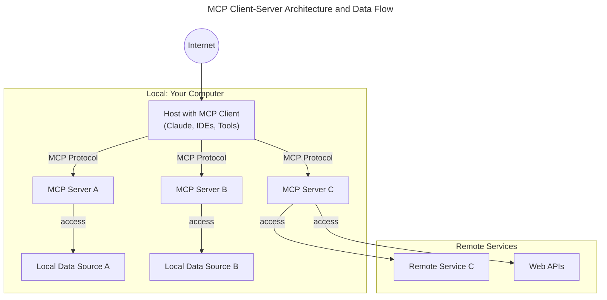

# MCP (Model Context Protocol): Introduction

[MCP Official Introduction](https://modelcontextprotocol.io/introduction)

Model Context Protocol (MCP) is an open standard for connecting AI agents, applications, and tools to a wide variety of models and services. Think of MCP like a USB-C port for AI applications: just as USB-C provides a standardized way to connect devices to peripherals, MCP standardizes how AI models connect to data sources and tools.

## Why MCP?
MCP helps you build agents and complex workflows on top of LLMs. LLMs frequently need to integrate with data and tools, and MCP provides:
- A growing list of pre-built integrations that your LLM can directly plug into
- The flexibility to switch between LLM providers and vendors
- Best practices for securing your data within your infrastructure

## General Architecture
At its core, MCP follows a client-server architecture where a host application can connect to multiple servers:

- **MCP Hosts:** Programs like Claude Desktop, IDEs, or AI tools that want to access data through MCP
- **MCP Clients:** Protocol clients that maintain 1:1 connections with servers
- **MCP Servers:** Lightweight programs that each expose specific capabilities through the standardized Model Context Protocol
- **Local Data Sources:** Your computer’s files, databases, and services that MCP servers can securely access
- **Remote Services:** External systems available over the internet (e.g., through APIs) that MCP servers can connect to

## Key Features
- Standardized API for model interaction
- Support for retrieval, summarization, Q&A, and more
- Open ecosystem with prebuilt servers and community contributions

## Learn More
- [MCP Official Website](https://modelcontextprotocol.io/introduction)
- [MCP Servers (GitHub)](https://github.com/modelcontextprotocol/servers)
- [MCP for Beginners (GitHub)](https://github.com/microsoft/mcp-for-beginners)
